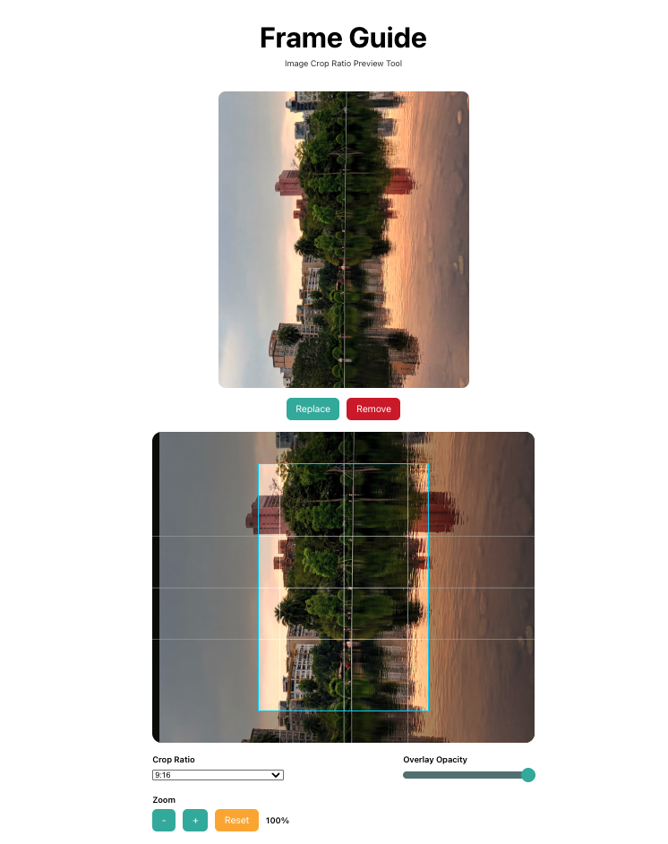

# Frame Guide

Frame Guide is a lightweight image crop ratio preview tool built with React and TypeScript. It allows users to upload an image, zoom, drag, and preview different crop ratios in real time through an adjustable overlay layer.

## Inspiration

When preparing images on desktop for social media platforms like Instagram, it can be difficult to predict how the final composition will look after cropping. I often wanted a quick way to preview framing and composition before uploading.

This project was inspired by that workflow — a simple tool to simulate crop ratios and help visualize image composition before posting.

## 👀 Demo

[Live Demo](https://frame-guide.vercel.app/)

## Features

- 📤 Upload and preview images instantly
- 🖱 Drag image position freely within the stage
- 🔍 Zoom in / zoom out image scaling
- 📐 Switch between multiple crop ratios
- 🎛 Adjustable overlay opacity
- ♻ Reset zoom and position
